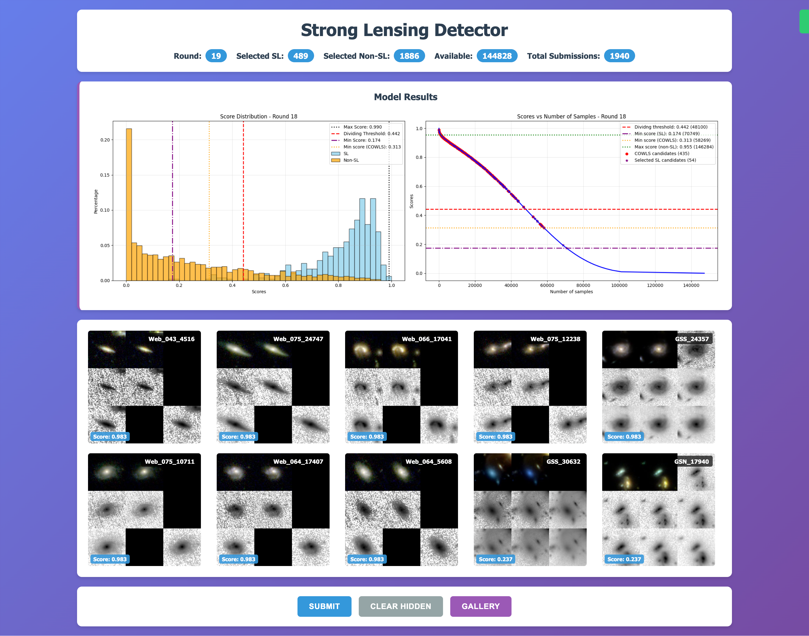
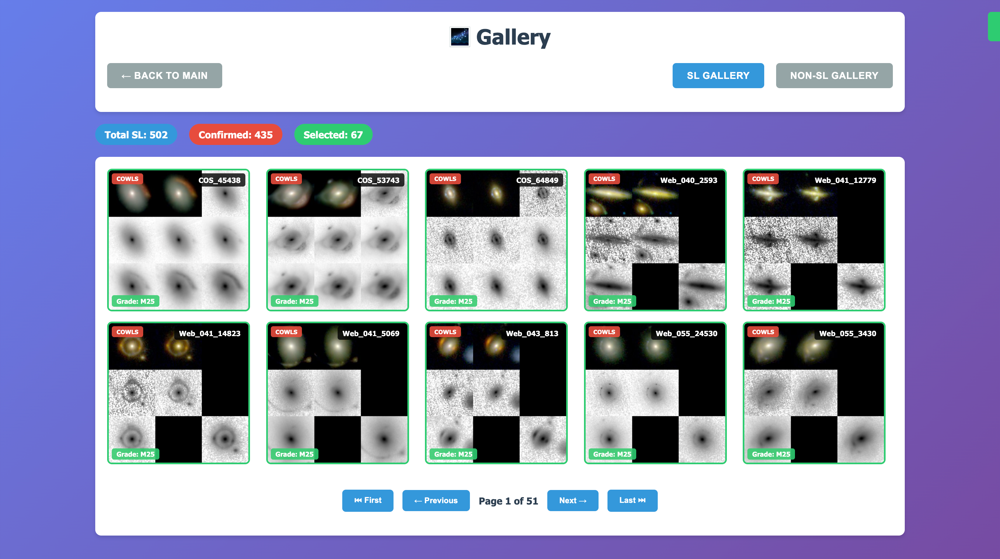

# SL_discovery_by_HITL

Relevant codes for strong lensing discovery by human-in-the-loop (HITL) method.  
HITL requires interaction between human and machine, where a simple website can be employed.  

This website can be employed to discover strong gravitational lensing (or other rare objects) without baseline training data.  

The pipeline was successfully tested, and we are currently preparing the draft.  Detailed information on the method will be added when finishing the draft. 

## Results

Will be updated soon.

## Dataset

Will be updated soon.

## Dependencies

``
python >= 3.12  
numpy  
torch  
astropy  
pandas  
matplotlib  
scipy  
joblib  
tqdm  
flask  
``

## The appearance of the website

### Detector page
  

The head shows the current round, the number of strong lensing (SL) sources, including data matched from other research, the number of non-strong lensing (non-SL) sources, the number of available sources, and the total number of submissions.  

The middle part shows the model results of current round. *Left panel*: score distribution for SL and non-SL sources, which are normalized respectively. The dividing threshold is calculated using Gaussian Mixture Model (GMM) and shown by red dashed line. *Right panel*: scores vs. number of samples. Simiarly, the dividing threshold is shown by red dashed line. Additionally, the minimum score for candidates of COWLS and selected SL sources are shown by orange dashed line and purple dash-dotted line respectively. The positions for them are also marked by red dots and purple stars respectively. 

Behind the model results, the source images are shown in a 2 * 5 grid. Source name and score are shown on the lower-left and higher-right corner of each image. Left-click on on image mask it as non-SL, right-click displays popup window, rendering enlarged image for detailed inspection.

At the bottom, the "Submit" and "Gallery" buttons are shown. The "Submit" button need to be clicked to submit the selections. Once the submissions reaches a certain number controled by configurations in `configurations.py`, the model will be trained on the postive and negative samples. The "Gallery" button redirects to the gallery page.

### Gallery page
  

The gallery page shows the SL and non-SL sources in 2 * 5 grid. SL ones include sources from COWLS and selected SL ones. For COWLS ones, the grades and source names are displayed. 

## Usage

``Python
python app.py 
``

The website will start at the default port 6543, while the logging and results will be saved in the `results` directory.

For more detailed usage, please modify the configurations in `configurations.py`, which are self-explanatory. Here we explain some difficult-to-understand configurations:  
`supplement_ratio`: the ratio of supplement images instead of only high-score ones shown in each page;  
`supplement_method`: the method to select supplement images, can be `threshold` or `uncertainty`. The former selects the supplement images by the distance to the dividing threshold, while the latter selects them by the uncertainty derived from the ensemble network;  
`num_submission_train`: the number of submissions required to train the model;  
`fix_ensembles`: if True, the number of ensembles will equal to the `maximum_ensemble_size`, otherwise, the number of ensembles increases by one after each training round, and the oldest ensemble will be removed when the number of ensembles exceeds `maximum_ensemble_size`;  
`checkpoint_round`: the round to resume from. If not None, the model will be loaded from the checkpoint and the training will resume from the next round.  

